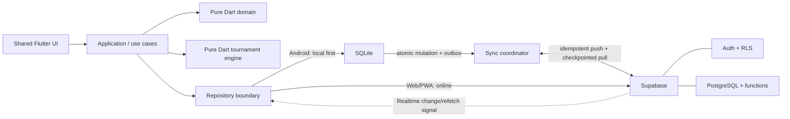

# Architecture Baseline

## Scope

This document defines the conceptual Version 1 architecture and the foundations
established through Milestone 2. It deliberately does not prescribe a final
feature-folder layout. Persistence implementations, backend, synchronization,
authentication, and tournament-engine implementation begin only in later
milestones.

## Milestone 1 implemented foundation

- `ProviderScope` wraps the application at the composition root. Riverpod is
  the approved state-management and dependency-injection foundation.
- `MaterialApp.router` hosts a single `/` route through GoRouter. Unknown routes
  render a visible, safe not-found page.
- The presentation contains only a restrained bootstrap page. It does not
  include feature navigation or application workflows.
- Compile-time `APP_ENV` selection distinguishes `development`, `test`, and
  `production` without storing URLs, credentials, or backend configuration.
- Riverpod coordinates future state and dependency composition; it does not
  replace the future repository boundary, Android SQLite persistence, atomic
  local transaction/outbox design, or synchronization coordinator.

## Milestone 2 implemented boundary

- `lib/src/domain` is a pure-Dart inward boundary. It imports no Flutter,
  Riverpod, GoRouter, storage provider, networking, or platform library.
- Immutable domain records own validation and adjacent state-transition rules.
  Caller-supplied UTC metadata keeps behavior deterministic.
- Typed UUID-backed IDs prevent cross-entity identity substitution, and Money
  uses integer minor units.
- Player, event, and match repository interfaces are ports expressed only in
  typed domain records, queries, failures/results, `Future`, and `Stream`.
- Future Android SQLite and Supabase implementations will be outward adapters;
  neither adapter exists in Milestone 2 or is visible to the domain.
- The M1 presentation remains a bootstrap only and is not wired to domain data
  or repository providers.

## Layers and responsibilities

### Shared Flutter presentation layer

Provides Android and Web/PWA screens, navigation, user interaction, and state
presentation. It invokes application use cases and does not contain tournament,
persistence, authorization, or synchronization rules.

### Application/use-case layer

Coordinates user actions, permissions, domain policies, repository calls, and
transaction boundaries. It exposes workflows suitable for both platforms while
selecting platform-appropriate persistence paths through abstractions.

### Pure Dart domain layer

Defines business concepts, validated state transitions, identities, and rules
without depending on Flutter, SQLite, Supabase, or the network.

### Pure Dart tournament engine

Deterministically generates and progresses only Single Elimination, Double
Elimination, Single Round Robin, and Double Round Robin. It remains separately
testable with fixtures and invariants and does not perform UI, storage, or
network work.

### Repository boundary

Defines storage-neutral contracts used by application use cases. Local and
remote implementations translate between persistence representations and
domain concepts without leaking infrastructure details into the domain. The
dependency direction is adapter → repository port/domain; domain code never
imports an adapter. Milestone 2 defines only the ports.

### Android SQLite local data source

Stores the Android working set and is the immediate source of truth for
important offline-capable organizer operations. A local mutation and its
outbox operation are committed atomically in the same SQLite transaction.

### Android synchronization coordinator

Observes connectivity and session capability, submits pending outbox operations
in order, reconciles remote changes using checkpoints, records failures and
conflicts, and refreshes local state. It operates behind the synchronization
boundary rather than inside presentation or domain logic.

### Supabase remote data source

Supabase is the shared convergence point for Android and Web/PWA data.
PostgreSQL stores shared records; Supabase Authentication establishes identity;
row-level security (RLS) enforces access; database functions provide critical
transactional and idempotent cloud operations; and Realtime announces relevant
changes.

### Flutter Web/PWA online path

The iPhone Safari Web/PWA uses the online Supabase repository path. Version 1
does not promise native iPhone offline mutation. An authenticated organizer can
perform authorized management operations while online.

## Conceptual flow

## Source-of-truth distinctions

- On offline-first Android, SQLite is the operational source for the current
  local view and pending changes.
- Supabase PostgreSQL is the shared convergence point and authoritative shared
  cloud state across Android and Web/PWA clients.
- The outbox is the durable source of pending Android synchronization intent;
  it is not the shared business record.
- Realtime is only a change/refetch signal. Repositories refetch durable data;
  Realtime payloads are not the source of truth.
- Finalized match records are the source of truth for match-derived statistics
  where practical. Derived totals must be reproducible from those records.
- Supabase Authentication is the source of authenticated cloud identity, while
  application roles and permissions determine organizer authority.

## Architectural invariants

1. Domain and tournament-engine code remains pure Dart and infrastructure-free.
2. Players are permanent reusable records; teams are temporary and scoped to an
   event/division.
3. Player participation never requires an account, and a later approved claim
   links rather than replaces a player record.
4. Guests cannot modify data; organizers authenticate and must have explicit
   permission.
5. Important Android organizer mutations succeed locally without network access
   and create an outbox operation in the same transaction.
6. Every synchronized mutation has a client-generated UUID operation ID and is
   safe to retry idempotently.
7. Critical cloud operations are transactional, authorize the actor, validate
   expected versions, and avoid partial bracket or queue progression.
8. Critical conflicts are surfaced for explicit handling; silent
   last-write-wins is prohibited.
9. Completed history is preserved. Removal, when needed, uses an auditable
   tombstone rather than destructive loss of shared history.
10. Realtime never bypasses repository validation or synchronization rules.
11. Only the four approved tournament formats enter the Version 1 engine.
12. Infrastructure choices and usage must remain within free tiers.

Detailed synchronization semantics are recorded in [SYNC.md](SYNC.md), and the
conceptual entities are recorded in [DATABASE.md](DATABASE.md).
