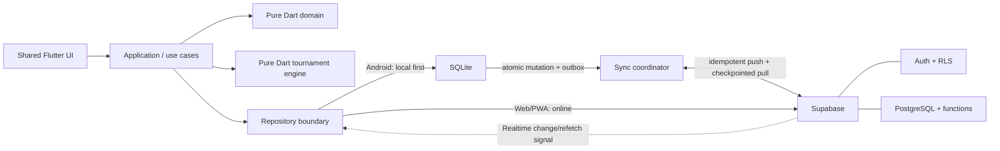

# Architecture Baseline

## M15 Double Elimination

The pure Dart engine builds deterministic Winners, Losers, Grand Final 1 and
conditional Grand Final 2 structure from M12 canonical team order and M13 seed
placement. Planned keys are independent of database UUID allocation. BYEs
advance without fake matches, scores, or losses. A team is eliminated only by
its second played loss.

Android Drift schema 9 stores the aggregate snapshot, durable outbox and pull
checkpoint alongside the existing match, dependency, revision and placement
records. Web calls the fixed organizer-authorized cloud aggregate online and
never initializes SQLite. Realtime only hints an authoritative pull. The UI
renders separate horizontally scrollable Winners, Losers and Grand Finals
sections. M16 court scheduling and queue behavior remain absent.

## M13 Single Elimination

A pure deterministic generator and immutable bracket state reuse M12 contracts.
Application commands separate previews from confirmed writes. Android commits
normalized matches, dependencies, placements, revisions and outbox atomically;
Web calls fixed organizer RPCs without SQLite. Public bracket reads omit private
account/payment data. See [M13](milestones/M13_SINGLE_ELIMINATION.md) for current
validation and acceptance evidence. Reorder controls edit a local preview;
only confirmed generation persists and synchronizes the seed order.

## M12 tournament foundation

Pure Dart tournament contracts/invariants are inward of application adapters.
Immutable planned keys do not depend on database UUID generation; canonical
input is organizer-ordered or TeamId-ordered. Score rules implement OPEN-003.
M9 aggregate synchronization carries Registration-only format selection;
readiness is read-only and independently rechecked locally/in PostgreSQL.
Selection creates no matches. No concrete generators or match synchronization.
See the [M12 record](milestones/M12_TOURNAMENT_ENGINE_FOUNDATION.md).

## Scope

This document defines the conceptual Version 1 architecture and the foundations
established through Milestone 10. It deliberately does not prescribe a final
feature-folder layout. Authentication flows, full operational synchronization,
organizer event workflows, and tournament-engine implementation begin only in
later milestones.

## Milestone 1 implemented foundation

- `ProviderScope` wraps the application at the composition root. Riverpod is
  the approved state-management and dependency-injection foundation.
- `MaterialApp.router` hosts a single `/` route through GoRouter. Unknown routes
  render a visible, safe not-found page.
- The presentation contains only a restrained bootstrap page. It does not
  include feature navigation or application workflows.
- Compile-time `APP_ENV` selection distinguishes `development`, `test`, and
  `production` without storing URLs, credentials, or backend configuration.
- Riverpod coordinates future state and dependency composition; it does not
  replace the future repository boundary, Android SQLite persistence, atomic
  local transaction/outbox design, or synchronization coordinator.

## Milestone 2 implemented boundary

- `lib/src/domain` is a pure-Dart inward boundary. It imports no Flutter,
  Riverpod, GoRouter, storage provider, networking, or platform library.
- Immutable domain records own validation and adjacent state-transition rules.
  Caller-supplied UTC metadata keeps behavior deterministic.
- Typed UUID-backed IDs prevent cross-entity identity substitution, and Money
  uses integer minor units.
- Player, event, and match repository interfaces are ports expressed only in
  typed domain records, queries, failures/results, `Future`, and `Stream`.
- Future Android SQLite and Supabase implementations will be outward adapters;
  neither adapter exists in Milestone 2 or is visible to the domain.
- The M1 presentation remains a bootstrap only and is not wired to domain data
  or repository providers.

## Milestone 3 implemented cloud boundary

- Version-controlled Supabase migrations define the initial PostgreSQL schema,
  foreign keys, constraints, indexes, RLS policies, grants, and Realtime
  publication membership in the existing Tokyo project.
- Public permanent-player and tournament records contain no Supabase Auth user
  ID. Profiles and normalized role rows remain private identity data.
- A private, safe-search-path `SECURITY DEFINER` helper answers whether the
  current Auth user has an active organizer permission. It creates no organizer
  automatically and cannot be used by clients to grant roles.
- Anonymous and authenticated clients can read non-deleted public records.
  Official writes require authenticated organizer permission; payments are
  organizer-only and account rows are owner-private.
- Flutter reads `SUPABASE_URL` and `SUPABASE_PUBLISHABLE_KEY` through
  compile-time Dart defines. Both absent means an intentionally unconfigured
  client; partial configuration is rejected without echoing values.
- `supabase_flutter` initialization is isolated behind a small initializer and
  nullable Riverpod client provider. The M1 bootstrap does not access the
  network or display backend data.
- The service-role or Supabase secret key is never a Flutter dependency or
  runtime configuration value.

## Milestone 4 implemented Android local boundary

- Drift provides typed SQLite access for the twelve operational M2/M3 tables;
  it is an access layer, not a replacement database.
- Android stores `vpc.sqlite` in its application-support directory and executes
  database work through Drift's background isolate. Foreign keys are enabled.
- Version-one schema checks, partial unique indexes, restrictive foreign keys,
  and transition/scope triggers protect local structural consistency.
- ISO-8601 text preserves UTC timestamp sub-second precision. UUID text is
  revalidated through nominal M2 ID constructors at repository mapping time.
- Production Drift adapters implement the existing player, event, and match
  repository ports without importing Drift into the domain.
- Riverpod owns the database lifecycle and closes it on disposal. Android gets
  real adapters; Web and unsupported native platforms get no local database.
- The bootstrap remains visually unchanged and does not read or display local
  records.
- There is no outbox, synchronization coordinator, Supabase fallback, or
  Realtime subscription in the local adapter.

## Milestone 5 implemented synchronization slice

- Permanent players are the sole production synchronization slice. The design
  is reusable, but no other operational table is claimed as synchronized.
- Android schema version 2 adds separate durable outbox, pull-checkpoint, and
  conflict tables. A player mutation and its operation commit in one SQLite
  transaction through the existing `PlayerRepository` port.
- Pure-Dart application contracts isolate the coordinator from Drift and
  Supabase. Deterministic ordering, a single active run, interrupted-claim
  recovery, bounded batches, redacted failures, and bounded retry backoff live
  at this boundary.
- A narrow Supabase gateway calls organizer-guarded player apply/pull functions.
  Private operation receipts make identical retries idempotent; versions make
  stale writes explicit conflicts.
- Accepted cloud rows reconcile into SQLite without re-enqueueing. Pending
  incompatible local intent is preserved with both local and remote evidence;
  M5 chooses neither side automatically.
- Realtime subscribes only to `public.players`, coalesces notifications, and
  requests a checkpointed pull. It never treats notification payloads as a
  durable or authoritative player record.
- Android composes the real synchronization runtime only when both its local
  database and a configured Supabase client exist. Web opens no SQLite and
  receives no offline synchronization coordinator.

## Milestone 6 implemented public-read slice

- GoRouter now exposes a shared guest shell with `/`, `/events`, and stable
  `/events/:eventId` detail locations. The shell uses phone navigation at
  narrow widths and a navigation rail on wider browsers.
- Widgets depend on a Riverpod presentation controller and a provider-neutral
  `PublicEventReader`; they do not import Supabase or Drift.
- The public scope is deliberately limited to active `events` and
  `event_divisions`. Lifecycle status, not the wall clock, classifies upcoming,
  current (`registration`/`inProgress`), and completed
  (`completed`/`archived`) groups. Dates render from UTC values.
- Web composes the anonymous Supabase reader and never requests local
  persistence. Android reads last-known events/divisions from the existing
  Drift tables, then reconciles a complete authoritative public snapshot.
- Android public reconciliation creates no outbox operation, refuses to
  overwrite a newer local version, advances missed event lifecycle steps
  through the existing local trigger, and tombstones cache rows absent from a
  successful complete snapshot.
- A guest opening the public application does not start the M5 organizer player
  upload runtime. The player synchronization infrastructure remains available
  for a later authenticated lifecycle integration.
- M6 uses explicit refresh and pull-to-refresh. It does not add Realtime event
  subscriptions; the accepted change/refetch principle remains available for
  later use.

## Milestone 7 account and authorization boundary

- Pure-Dart `AuthRepository`, `AuthUser`, session/failure, account-profile,
  authorization, and player-claim contracts expose no Supabase, Drift, token,
  or platform type. Supabase adapters map SDK and PostgreSQL responses outside
  widgets and redact provider errors.
- Supabase Flutter restores its persisted session and owns token storage.
  Email/password registration and sign-in require connectivity; Web and
  Android share the same repository boundary. Public M6 routes remain usable
  while signed out.
- PostgreSQL roles and RLS are authoritative. Flutter presents guest/member/
  organizer/unavailable state, but never trusts user metadata or a cached
  Boolean as cloud authority and cannot mutate `user_roles`.
- The private profile owns the optional account-to-player link. A member can
  request an existing public player; only organizer-guarded transactional RPCs
  approve or reject. Public player rows still contain no Auth identity.
- Android does not mirror profiles, roles, or claims in SQLite and does not
  queue those online-only mutations. Web continues to initialize no SQLite.
- The M5 player runtime is created only after a live account snapshot confirms
  organizer permission. Member, guest, unavailable, and sign-out states
  invalidate it; the cloud reauthorizes every upload regardless of UI state.
- Confirmation callbacks are allow-listed at `/account/confirm` for Web and
  the narrowly scoped Android custom URI. Supabase Flutter processes PKCE/Auth
  callback material internally; application models and logs never receive
  tokens.

## Layers and responsibilities

### Shared Flutter presentation layer

Provides Android and Web/PWA screens, navigation, user interaction, and state
presentation. It invokes application use cases and does not contain tournament,
persistence, authorization, or synchronization rules.

### Application/use-case layer

Coordinates user actions, permissions, domain policies, repository calls, and
transaction boundaries. It exposes workflows suitable for both platforms while
selecting platform-appropriate persistence paths through abstractions.

### Pure Dart domain layer

Defines business concepts, validated state transitions, identities, and rules
without depending on Flutter, SQLite, Supabase, or the network.

### Pure Dart tournament engine

Deterministically generates and progresses only Single Elimination, Double
Elimination, Single Round Robin, and Double Round Robin. It remains separately
testable with fixtures and invariants and does not perform UI, storage, or
network work.

### Repository boundary

Defines storage-neutral contracts used by application use cases. Local and
remote implementations translate between persistence representations and
domain concepts without leaking infrastructure details into the domain. The
dependency direction is adapter → repository port/domain; domain code never
imports an adapter. Milestone 2 defines only the ports.

### Android SQLite local data source

Milestone 4 stores the Android working set and supplies transactional local
repository adapters. The future requirement for a local mutation and its
outbox operation to commit atomically remains an M5 synchronization concern;
M4 deliberately has no outbox.

### Android synchronization coordinator

Observes connectivity and session capability, submits pending outbox operations
in order, reconciles remote changes using checkpoints, records failures and
conflicts, and refreshes local state. It operates behind the synchronization
boundary rather than inside presentation or domain logic.

### Supabase remote data source

Supabase is the shared convergence point for Android and Web/PWA data.
PostgreSQL stores shared records; Supabase Authentication establishes identity;
row-level security (RLS) enforces access; database functions provide critical
transactional and idempotent cloud operations; and Realtime announces relevant
changes.

Milestone 3 implements the schema/security/publication foundation. Milestone 6
adds the anonymous event/division read adapter. Milestone 7 adds Auth and
claim-specific adapters but no organizer tournament-data write adapter.

### Flutter Web/PWA online path

The iPhone Safari Web/PWA uses the online Supabase repository path. Its M6 guest
event reader has no SQLite or Web offline cache. Version 1 does not promise
native iPhone offline mutation; later authenticated organizers operate online.

## Conceptual flow

## Source-of-truth distinctions

- On offline-first Android, SQLite is the operational source for the current
  local view and pending changes.
- Supabase PostgreSQL is the shared convergence point and authoritative shared
  cloud state across Android and Web/PWA clients.
- The outbox is the durable source of pending Android synchronization intent;
  it is not the shared business record.
- Realtime is only a change/refetch signal. Repositories refetch durable data;
  Realtime payloads are not the source of truth.
- Finalized match records are the source of truth for match-derived statistics
  where practical. Derived totals must be reproducible from those records.
- Supabase Authentication is the source of authenticated cloud identity, while
  application roles and permissions determine organizer authority.

## Architectural invariants

1. Domain and tournament-engine code remains pure Dart and infrastructure-free.
2. Players are permanent reusable records; teams are temporary and scoped to an
   event/division.
3. Player participation never requires an account, and a later approved claim
   links rather than replaces a player record.
4. Guests cannot modify data; organizers authenticate and must have explicit
   permission.
5. Important Android organizer mutations succeed locally without network access
   and create an outbox operation in the same transaction.
6. Every synchronized mutation has a client-generated UUID operation ID and is
   safe to retry idempotently.
7. Critical cloud operations are transactional, authorize the actor, validate
   expected versions, and avoid partial bracket or queue progression.
8. Critical conflicts are surfaced for explicit handling; silent
   last-write-wins is prohibited.
9. Completed history is preserved. Removal, when needed, uses an auditable
   tombstone rather than destructive loss of shared history.
10. Realtime never bypasses repository validation or synchronization rules.
11. Only the four approved tournament formats enter the Version 1 engine.
12. Infrastructure choices and usage must remain within free tiers.

Detailed synchronization semantics are recorded in [SYNC.md](SYNC.md), and the
conceptual entities are recorded in [DATABASE.md](DATABASE.md).

## M14 round-robin boundary

Pure Dart circle-method generation implements only Single and Double Round
Robin. Planned keys, round positions, legs, seed order, and BYE rests are
deterministic; a BYE is presentation metadata and never a Match. Standings are
derived from active completed Match records and the V1-079 recursive tie-break
order. Mutable wins/losses/points totals are not stored.

Android persists the schedule snapshot, match rows, immutable correction
revisions, final placements, and one outbox command atomically. Web uses the
same application contract through fixed online Supabase RPCs and never opens
SQLite. Both use authoritative refreshes; Realtime payloads are hints only.
Round-robin matches are independent and create no match dependencies. M15 owns
Double Elimination and M16 owns the court queue.
## M8 permanent player directory boundary

M8 adds a provider-neutral player directory query port above the M2 player
domain. Widgets depend on Riverpod presentation state, never Drift or Supabase.
On Android, the reader shows active Drift rows first and reconciles validated
public cloud rows without producing outbox mutations or replacing unresolved
local work. Organizer creation continues through the M5 atomic player/outbox
repository and coordinator. On Web, reads and organizer creation use the
online Supabase adapters and no SQLite database is initialized.

The public projection contains no private Auth/profile/role/claim data. The
basic profile deliberately has no skill or derived-stat fields. Realtime is
still a refresh hint through the existing M5 runtime, and PostgreSQL RLS/RPC
authorization remains the final organizer boundary.

## M9 event/division aggregate boundary

M9 adds pure-Dart event-setup use cases above platform adapters. Android commits
an event, divisions, and aggregate outbox operation atomically; Web invokes the
fixed organizer-authorized cloud aggregate online and opens no SQLite. Pull
reconciliation creates no outbox work and preserves pending/conflicted local
aggregates. Realtime remains a refetch hint.

Division tournament format is nullable until M12. Null explicitly represents
unconfigured setup and introduces no enum/default. The domain and database
block REGISTRATION → IN PROGRESS while an active division remains null.

## M10 participation aggregate boundary

Framework-independent participation use cases coordinate permanent players,
event participants, division assignments, and event-scoped payment status.
Widgets depend on these ports and never call Drift or Supabase directly.

Android Drift schema version 4 commits a participant aggregate and one fixed
outbox operation atomically. A bounded coordinator uploads organizer-authorized
operations, preserves authorization blocks and version conflicts, and pulls
authoritative tombstones without overwriting pending local intent. Web uses the
same payload contract through an online Supabase adapter and initializes no
SQLite. PostgreSQL RLS and fixed functions remain the final authorization
boundary. Payment rows remain private and store only Paid/Unpaid.

## M11 team-formation boundary

M11 extends the pure Dart player model with nullable `PlayerSkill` and keeps
formation algorithms in an application service with injected IDs and
randomness. `null` means Unrated. Manual, seeded-random, and deterministic
strongest-with-weakest balanced previews perform no persistence until explicit
confirmation.

Android reads eligible checked-in division participants from Drift and commits
the complete replacement plus one outbox operation atomically. Web composes an
online Supabase adapter and never initializes SQLite. A fixed organizer-only
RPC validates and replaces the team aggregate transactionally. Realtime remains
a refetch hint. Tournament formats, seeding, brackets, matches, and schedules
remain M12+ concerns.
